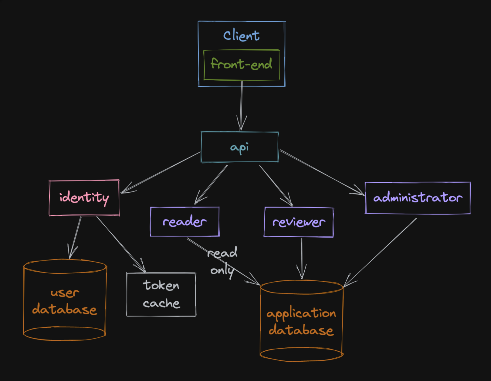

[arad](../../../../) / [documentation](../)

# Design

## Table of Contents

- [Front-end Layer](#front-end-layer)
- [API Layer](#api-layer)
- [Service Layer](#service-layer)
    - [Identity](#identity)
    - [Reader](#reader)
    - [Reviewer](#reviewer)
    - [Administrator](#administrator)
- [Infrastructure Layer](#infrastructure-layer)
    - [Database](#database)
    - [Cache](#cache)

### Further reading

- [The Anatomy of an Arad Production Deployment](./deployment.md)
- [Domain and Data Model](./domain-data.md)
- [Project Structure](./project.md)
- [Front-end Architecture](./front-end.md)
- [The API nginx proxy](./api.md)
- [Endpoint Design](./endpoint.md)
- [How an Arad service node is architected](./service.md)

## Overview

`Arad` is designed in layers. A layer receives a request from above, does some processing and makes requests to the
layer below to compose a response to return to the layer above. By enforcing this architecture (easy enough in this
application) we can ensure our [distributed traces](https://en.wikipedia.org/wiki/Tracing_(software))
are short, understandable and debuggable.

Within services, we maintain a similar rigidity and layering where layers only interact up and down with adjacent
layers, in isolation from processes in their own layer. Thanks to A. Tucker for teaching me this technique. In the
future, should we have the need for more complex behaviours, we may consider adding another `orchestration` layer 
between `api` and the `service` layer and some sort of data pipeline in the `infrastructure` layer that allows us
maintain state during orchestration (though they do all use the same database...).

By grouping functionality by user type/concern, we can scale components of the system independently, reacting to
changes in user behaviour.

## Front-end Layer
The top layer, the [`front-end`](https://en.wikipedia.org/wiki/Frontend_and_backend), is located in a web `client`. The
client may take many forms. Some examples include web browsers, mobile phones, or a variety of
[headless](https://en.wikipedia.org/wiki/Headless_computer) clients. Perhaps a remote [cli](https://en.wikipedia.org/wiki/Command-line_interface).
In most of these documents, we assume the front end is our SPA code running a web browser, but there is nothing
preventing other consumers of the API from utilizing it.

The `front-end` is a [React](https://reactjs.org/) [Single Page Application](https://en.wikipedia.org/wiki/Single-page_application).

## API Layer
The `front-end` commmunicates with the `back-end` stack (everything else) through the internet, and ultimately, an
interface service called `api` - ([Application Programming Interface](https://en.wikipedia.org/wiki/API)). The sole
responsibility of `api` is to proxy incoming requests to the appropriate `back-end` services. Navigating down the stack,
`api` is the second layer.

## Service Layer
`api` delegates responsibility for processing these requests to one of four `back-end` services. The four services
running in the backend compose the `service` layer of our software graph. The services do not use any form of
direct inter-service messaging, like synchronous [RPC](https://en.wikipedia.org/wiki/Remote_procedure_call).
Additionally, they do not use any sophistocated mechanisms to transfer data and state. Instead, all user and
application state is stored in a relational database and cached in a distributed memory store where appropriate. This
eliminates several operational problems and should work well for this simple, read-heavy application.

### Services

#### Identity
[identity](./services/identity.md) is the foundational piece of the service layer, providing authentication and
authorization capabilities to permit [RBAC](https://en.wikipedia.org/wiki/Role-based_access_control). As there is no
inter-service communication, we rely on other mechanisms ([JWTs](#authentication-in-the-service-layer)) to authorize
user actions.

#### Reader

The [reader](./services/reader.md) service is where most of the run-time compute resources for Arad will be consumed.
This service responds to requests from everyone, both authenticated and unauthenticated. A `reader` role has been
included in the RBAC model for completeness but due to the nature of `Reader` access, it will rarely be used.

#### Reviewer

The [reviewer](./services/reviewer.md) service will allow `Reviewers` to submit reviews about articles.

#### Administrator

The [administrator](./services/administrator.md) service will allow `Administrators` to modify information about
articles and users.

### Authentication in the Service Layer
Two forms of authentication exist in identity. Short-lived and long-lived. Access is controlled by short-lived tokens
that are generated using a long-lived refresh token that is acquired through user authentication (password, sso, etc).

[Here](https://www.oauth.com/oauth2-servers/making-authenticated-requests/refreshing-an-access-token/) is an example of
such a scheme.

For example, one scenario requiring protection is the ability of an `Administrator` to list users. We cannot allow
users without `Administrator` priveleges to manage or view other user accounts. To accomplish this, we will use a
concept of `roles` named `reader`, `reviewer`, and `administrator`. The roles are not exclusive. Each short-lived access
token can be assigned a `scope` that corresponds to a `role`. This permits modularity of composition when applying RBAC.

When an `Administrator` clicks `Manage Users`, for example, the `front-end` will:
1. Examine its local data store for a valid, short-lived, `administrator`-scoped token.
1. Depending on the result the `front-end` will:
    1. Attempt to retreive another access token with the current refresh token. Depending on the result:
        1. Use the short-lived token to access the resource.
        1. Redirect back to the login page.
    1. Use the short-lived token to access the resource.

This kind of separation of concerns allows us to easily implement additional authentication when acquiring an
`administrator` token, for example, and easily not requiring authentication when requiring a `reviewer` token. If we
have need for higher security in the future, additional protocols can be layered on as the system is extended.

Arad uses asymmetric keys for JWTs. This permits a 'contactless', least privlege authorization mechanism for remote
resources. Currently ES256 is employed. We should consider upgrading to ES512 to increase the longevity of the keys.

## Infrastructure Layer

The infrastructure is composed of the database, and a distributed memory cache (not pictured) to improve performance.

By having only a single hard dependency, we can be assured of a higher uptime/downtime ratio.

### Database

The most useful and understood database type in this scenario is likely a relational database, but we are evaluating
alternatives. The current developer stack relies on PostgreSQL.

### Cache

To allow higher performance we can cache some database objects in memory (particularly, things like refresh tokens,
allowing only `identity` to access the cache).
