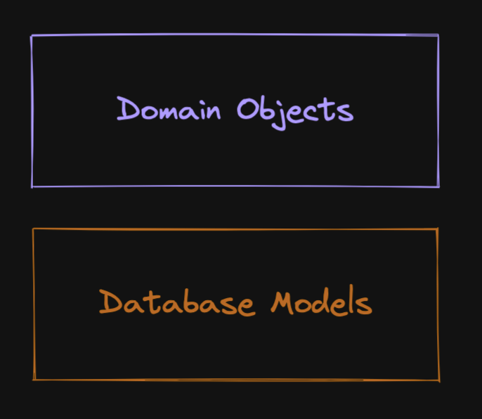
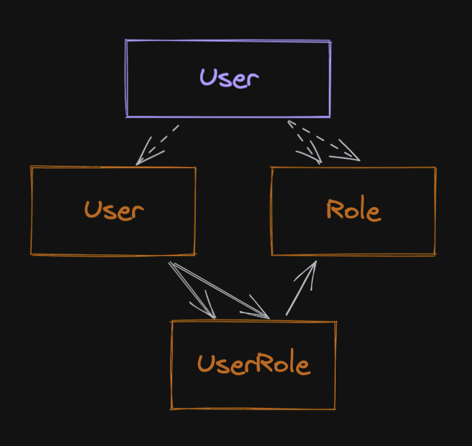
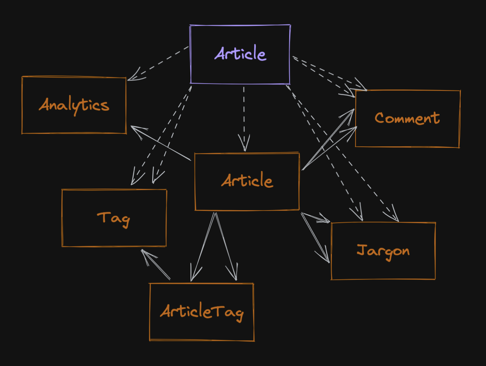
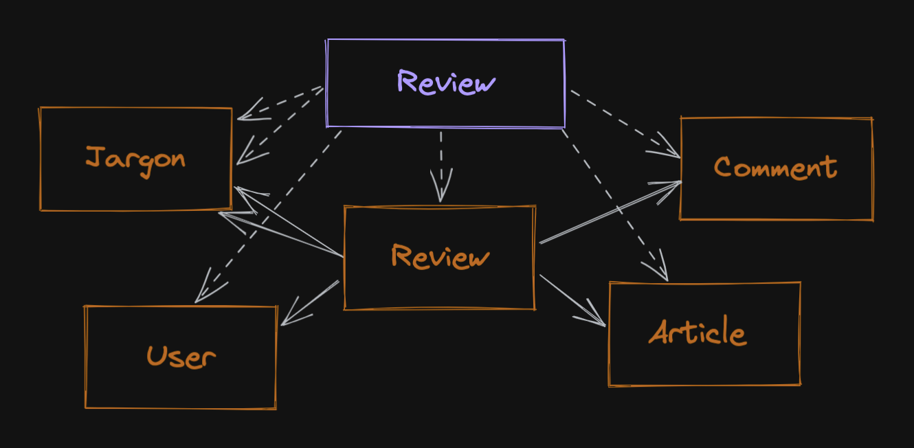

[arad](../../../../) / [documentation](../) / [design](./)

# Domain and Data Model

Domain and data modelling allow us to understand the problem space from different perspectives. The goal here is to
create two models that can interact to provide the correct application experience.

The domain model describes data entities from the domain perspective, uses real-world language for clarity, and
represents a template of the application state in memory at any given time. The domain model entities live in the
internal service layer of a service.

The data model describes data entities from the infrastructure perspective, and may use domain agnostic terms, at times,
for clarity. The data model represents a template of the application state on disk at any given time. The data model
entities live in the repository layer, and are defined in the model layer.

By decoupling these models through a repository layer abstraction, we are free to choose an entirely different
implementation for the data model (this is sometimes required for performance or cost reasons as scale increases),
or even an entirely different underlying infrastructure. The service layer interface will not change in this case, and
application/endpoint code that calls it will not need modification.

Effectively, we are describing a translation that happens in the repository layer. What I am saying, is that
as a rule, repositories should use database models to compose domain objects for use by services.

```
Domain objects = Domain model
Database models = Data model
```

## Domain Model

Arad is a simple distributed application. There are four services in the service layer, all backed by the same
underlying infrastructure, sharing the same domain model.

### User

An Arad `User` is a domain entity that consumes resources from the Arad backend api. Most likely, `Users` will interface
through the provided `front-end` UX, but this is not a hard requirement.

#### Attributes

- id: UUID
- email: string
- roles: Role[]

### Role

An Arad `Role` domain entity is an enumeration, and represents one of three possible values.

#### Possible Values:

- READER
- REVIEWER
- ADMINISTRATOR

### Article

An Arad `Article` is a domain entity that represents a real world research article. It is referenced by DOI (Digital
Object Identifier - [more details](https://en.wikipedia.org/wiki/Digital_object_identifier)).

#### Attributes

- id: UUID
- doi: string
- title: string
- author: string
- journal: string
- year: string
- volume: string | null
- pages: string | null
- duration: float
- difficulty: float
- jargon: string[]
- tags: string[]
- top_comments: string[]

#### Notes

We probably don't want to grab _all_ comments every time we assemble an Article. I'd rather assemble none and use
another call to paginate comments - it's documented the way it is here for clarity.

### Review

An Arad `Review` is a domain entity that represents a review created in the system by a reviewer. A reviewer may review
an article at most once.

#### Attributes

- id: UUID
- article_id: UUID
- user_id: UUID
- duration: int
- difficulty: int
- comment: string
- jargon: string[]

## Data Model

The data model is composed of entities that represent abstract concepts and concerns related to the real world objects
in the domain model. In this case, our data model is best described by the database schema used in our underlying
relational database.

### User

The `User` table actually contains a hashed passphrase, unlike the domain model. `Roles` are a related entity.

#### Fields

- id: UUID
- email: email [indexed]
- hashed_passphrase: string

### Role

The `Role` table contains three records at the moment, and is populated when the table is created in a migration.

#### Fields

- id: UUID
- name: string [indexed]

### UserRole

The `UserRole` table allows us to apply roles to a given user.

#### Fields

- id: UUID
- user_id: UUID [indexed]
- role_id: UUID

#### Constraints

- foreign_key(user_id, User.id)
- foreign_key(role_id, Role.id)
- unique(user_id, role_id)

### Article

The `Article` table contains most of the information required to populate our domain entity.

Duration and difficulty have two views - from a reader's perspective, these values come from the `Analytics` table and
are floating point values. From the reviewer's perspective, these values are integers that the reviewer supplies.

`Jargon`, `Comments` and `Tags` are all related entities. `Jargon` and `Tags` are many to one with `Articles`/`Reviews`,
but `Comments` are one to one with `Reviews`. Thus we can store `Comments` directly on the `Review`, if we desire.

#### Fields

- id: UUID
- doi: string [indexed]
- title: string [indexed]
- author: string [indexed]
- journal: string [indexed]
- year: string [indexed]
- volume: string [nullable]
- pages: string [nullable]

#### Constraints

- unique(doi)

### Tag

The `Tag` table allows us to create tags that apply to all articles.

#### Fields

- id: UUID
- name: string [indexed]

#### Constraints

- unique(name)

### ArticleTag

The `ArticleTag` table allows administrators apply administrator-defined `Tags` to articles.

#### Fields

- id: UUID
- article_id: UUID [indexed]
- tag_id: UUID [indexed]

#### Constraints

- foreign_key(article_id, Article.id)
- foreign_key(tag_id, Tag.id)
- unique(article_id, tag_id)

### Review

The `Review` table gives us a place to store individual review results.

`Jargon` is a set of related entities. Each review can own a single comment.

#### Fields

- id: UUID
- article_id: UUID [indexed]
- user_id: UUID [indexed] [nullable]
- duration: int [indexed]
- difficulty: int [indexed]

#### Constraints

- foreign_key(article_id, Article.id)
- foreign_key(user_id, User.id)
- unique(article_id, user_id)

#### Notes

Due to problem constraints, we must allow for reviews to be created without real users connected to them. This means
we have a couple choices - we can allow nulls in the field, or we can create fake users (we could use something like
our test domain with sequential usernames for the emails, with random bytes for the passphrases).

PostgreSQL should keep the unique constraint while allowing multiple nulls for the same article_id. This seems like
the clean choice.

### Comment

The `Comment` table lets us attach a single comment to a review and track impressions vs helpfulness from the reader
perspective (search view) to help us rank comments so we can display the top _N_.

#### Fields

- id: UUID
- article_id: UUID [indexed]
- review_id: UUID [indexed]
- user_id: UUID
- content: string
- impressions: int
- helped: int
- helpfulness: float

#### Constraints

- foreign_key(article_id, Article.id)
- foreign_key(review_id, Review.id)
- foreign_key(user_id, User.id)
- unique(review_id)

### Analytics

The `Analytics` table allows us to cache aggregated results on a per article basis. There is a one to one mapping between
articles and analytics records. They should be created in a transaction together.

Each time we add a new `Review`, we should, in a transaction, update the corresponding `Analytics` record (in a
transaction). This won't be a problem for our level of write load, but if you're having issues with this kind of thing
in your setup you may need to consider sharding.

#### Fields

- id: UUID
- article_id: UUID [indexed]
- duration: float [indexed]
- difficulty: float [indexed]

#### Constraints

- foreign_key(article_id, Article.id)
- unique(article_id)

### Jargon

The `Jargon` table allows us to associate jargon on a per `Review` basis, and the `article_id` field permits us to
compute counts to rank the most important terms.

#### Fields

- id: UUID
- review_id: UUID [indexed]
- article_id: UUID [indexed]
- term: string [indexed]

#### Constraints

- foreign_key(review_id, Review.id)
- foreign_key(article_id, Article.id)
- unique(review_id, term)

## Composition

What's this all about? Well, remember how we mentioned that we'd be constructing a repository layer to translate between
the data model and the service layer? This is how we map the data model to the domain.

Legend:



### User



### Article



### Review


