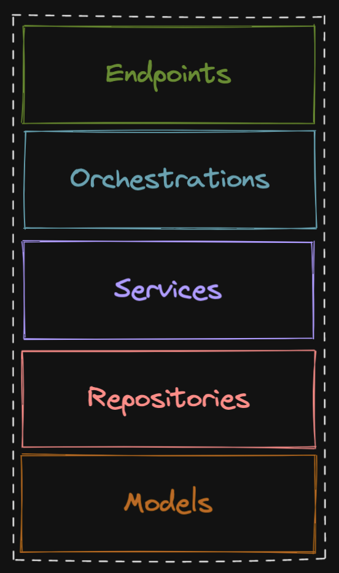

[arad](../../../../README.md) / [documentation](../README.md) / [design](./README.md)

# A typical Arad back-end service

Each `service` layer `service` is itself composed of multiple layers. The same rule applies here that applied to the
distributed architecture. We should only call _down_ deeper into the stack, never up or sideways. this prevents
circular stack traces and makes code easier to debug.

## Application layer

The application layer is responsible translating requests into orchestrations and encoding the response for a client.
The client could be a terminal, or a web client, or anything really. The whole point of the application layer is to
integrate with external callers. Within the application layer we partition code by integration type, and there is
uaully a one to one mapping between application level commands and orchestrations.

Authorization is typically applied here, but nothing prevents us from passing tokens deeper into the stack and applying
the authorization decorator wherever we want.

## Orchestration layer

We place an orchestration layer between the application (endpoints for instance) and services to decouple them and
delegate responsibility of encoding and decoding alone to the application layer. The orchestration layer orchestrates
service calls.

Initially we planned to not include this layer but it became clear with thought that we'd want to achieve similar things
with a CLI or REPL. Orchestrations can be called directly from these tools.

## Service layer

The service layer is where the application/domain logic will live. This is the most critical internal layer in the
entire distributed application. It is responsible for the core functionality of Arad.

It sequences actions, from the application perspective. For example, the `identity` service will have an endpoint
named `login` that accepts some form of authentication, and to perform this authentication, the endpoint must call
deeper into the application to reach the code that interfaces with the database. To accomplish this, the endpoint layer
above will use one or more services to invoke the required code in steps. The service code really only has one
objective in this application, to make its way to the database. We'll wrap the model code in repositories even through
it is not entirely necessary as we are doubtful to migrate off the initial data store.

## Repository layer

The repository layer provides an abstraction over the models, which represent database table schemas. As stated above,
it probably isn't entirely necessary to decouple the database and service layer with this repository layer, but it
should future-proof us if we want to change the interface to the database.

The repository layer composes domain objects for specific use cases using the [ORM](https://en.wikipedia.org/wiki/Object%E2%80%93relational_mapping)
of choice, SQLAlchemy, which acts on models. 

## Models

Models are the foundational element of our application, and provide it access to state. They are the closest thing to
the database, except maybe the SQAlchemy orm which is a pretty thin wrapper around SQL.

## Common code and sync

In addition to all the services, there is a `common` service that is not invoked when the application runs, but instead
holds code common to all other services. While we could package this up in a library, and may in the future, a simple
sync script accelerates development.
